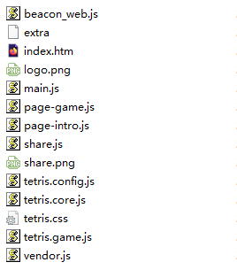
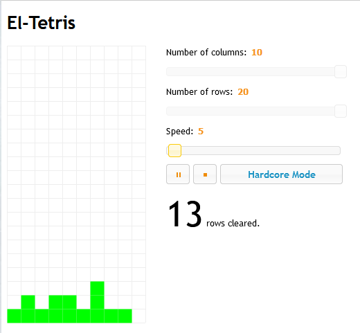
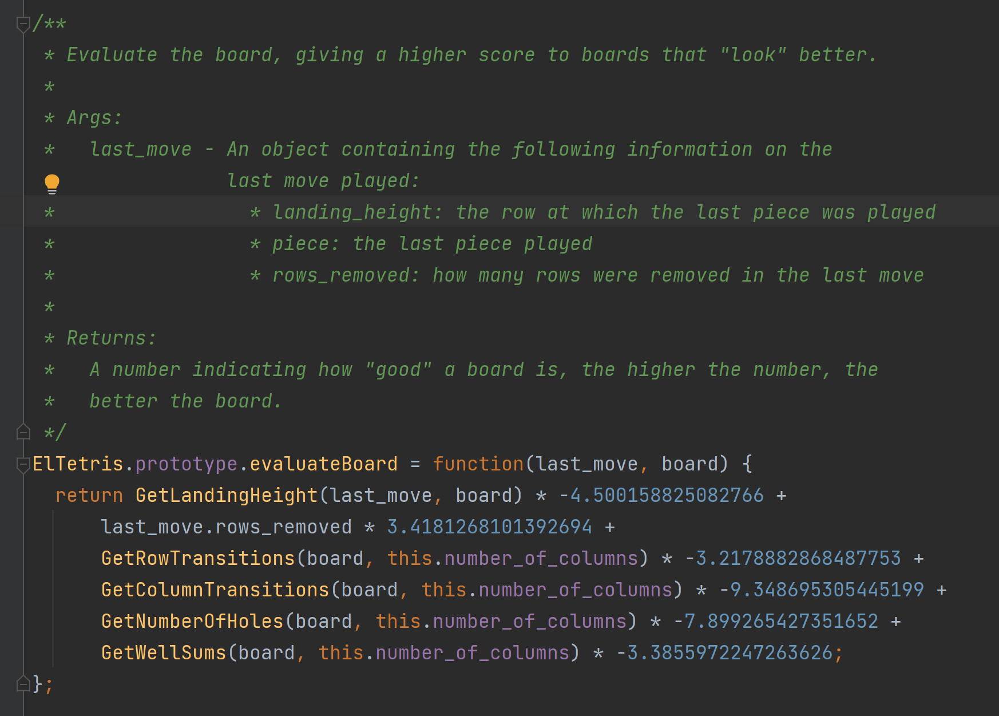
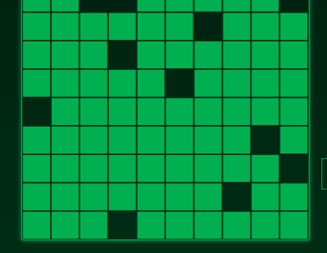
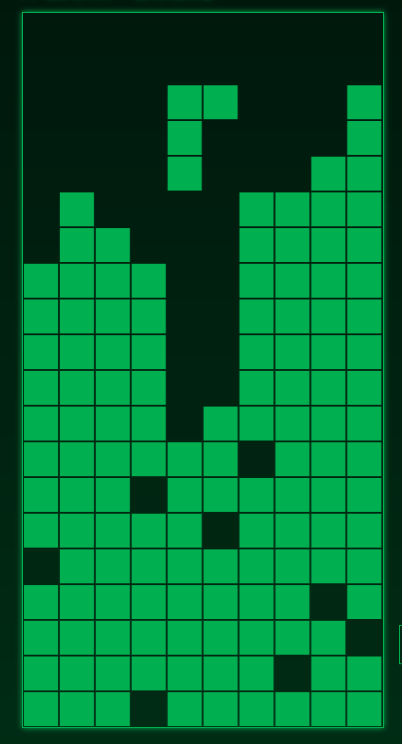
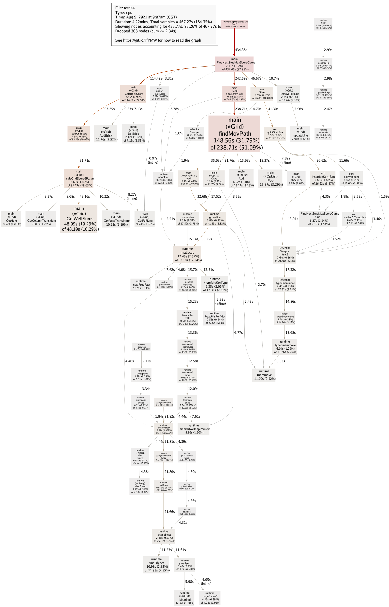

# Tetris
tetris是参加[【极客技术挑战赛第四期】鹅罗斯方块](https://geek.qq.com/tetris/#/) 的项目，这个项目是给定一个俄罗斯方块的固定序列，看看谁能消除的分数最高。


本项目最终得分881136，操作的序列参考[result.txt](./result.txt)文件。

解题的步骤主要分为了上手、实现、优化。

# 上手
1. 官方的俄罗斯方块玩了两下功能，按F12，观察网页里的js，游戏逻辑是用js写的，且注释里写了源文件的地址，下载下来阅读，参考[js](./js)目录。



2. 观察[index.htm](./js/index.htm),里面注释已经写好了提交方法。所以我们只需要生成自己的操作序列，提交即可参与排名。这里的N表示新块，D19表示下降19格。其他的C、L、R分别表示旋转、左移、右移。
```html
    <!-- 浏览器控制台快速调试方法（可直接复制到控制台中运行） -->
    <!-- 1、回放操作序列：game.pause();game.playRecord('N,D19,N,D17,N,D16,N,D14,N,D11,N,D9,N,D6,N,D4,N,D3,N,D1'.split(',')); -->
    <!-- 2、提交上传成绩（会消耗提交次数）：axios.post(`api/upload`, { record: 'N,D19,N,D17,N,D16,N,D14,N,D11,N,D9,N,D6,N,D4,N,D3,N,D1', score: 0 }).then(({ data }) => { console.log('提交结果', data); if(data.info) {console.log(data.info)} }); -->
```
3. 首先第一步要拿到1w个方块的序列，阅读js代码，找到[tetris.core.js](./js/tetris.core.js)文件的getRawBrick函数，进而找到随机函数。用golang重新实现一遍，把结果与原始的做对比，无误即可。随机函数实现如下：
```go
type Random struct {
	a int64 // 乘子
	M int64 // 模数
	C int64 // 增量
	v int64 // 随机数种子
}

func (r *Random) Reset() {
	r.a = 27073
	r.M = 32749
	r.C = 17713
	r.v = 12358
}

func (r *Random) Rand() int64 {
	v := r.v
	r.v = (v*r.a + r.C) % r.M
	return r.v
}
```
4. 然后需要定义网格及砖块等数据结构，这里比较简单，直接复制js的定义即可。砖块由类型+状态决定，网格则是直接定义一个二维数组，后面这里优化的时候会再涉及。
```go
type Brick struct {
	Ty   int
	Stat int
}

type Grid struct {
	area    [MaxCol][MaxRow]bool
}
```
5. 剩下的事情就是输出操作序列了，这里我们简单的直接输出官方的例子，然后拷贝到浏览器的console执行，看看回放的效果，以及是否提交ok。这里可以通过replayFreq控制回放速度。
```js
game.playFreq=1000
game.replayFreq=1
step='N,D19,N,D17,R2,D1,R1,D1,N,D17,L3,D2,N,D16,R1,D1,N,D15,R1,D1,R1,D2,N,C1,D15,R3,D1,R1,D2,N,C1,D14,R3,D1,R2,D1,N,C1,D14,L1,D2,L3,D2,N,C1,D15,R2,D1,N,C2,D15,L1,D3,N,D18,L1,D1,N,D16,L2,D1,L1,D1,N,C1,D16,L1,D1,N,D14,L1,D1,L1,D1,N,D15,R3,D3,N,D15,R1,D2,R1,N,C1,D14,L2,D1,L1,D1,N,C1,D16,N,D15,R3,D1,R1,D2,N,C3,D15,R3,D1,R2,D1,N,C1,D17,L1,D1,N,D18,N,D14,R2,D2,N,C1,D15,R3,D2,R1,N,C1,D15,L1,D1,N,D13,L2,D1,L1,D3,N,C1,D15,N,C1,D13,R1,D1,R1,D1,N,C1,D13,N,D10,L1,D1,L1,D3,N,C1,D10,L1,D1,L1,D1,N,C1,D11,R3,D7,N,C1,D12,R1,D1,R3,D3,N,D12,R1,D1,R3,D1,N,C1,D13,N,C3,D10,R1,D4,N,D12,R1,D1,N,D11,N,C1,D9,L1,D2,N,D8,R2,D1,R1,D3,N,C1,D8,L1,D1,N,D9,N,D7,R2,D1,R1,D3,N,D6,L1,D1,L1,D1,L1,D5,N,D7,L3,D1,L1,D1,N,D6,R2,D2,N,D7,N,D5,L1,D2,N,C3,D4,R2,D1,R2,D1,R1,D1,N,D6,L4,D1,N,D6,R2,D1,N,D5,L1,D1,N,D5,R4,D1,N,D4,L3,D1,N,D6,N,D3,R1,D1,R1,D1,N,D4,L2,D1,N,D2,R2,D1,R1,D1,R2,D1,N,C1,D2,L3,D1,L1,D1,N,D2,R2,D1,R1,D1,N,D4,N,D2,L3,D1,N,D2,R2,D1,R1,D1,N,D2,R4,D1,N,D3,L2,D1,N,D3,N,D1,L2,D1,N,R2,D1,R2,D1,N,D1,R1,D1,N'
game.pause();game.playRecord(step.split(','));
axios.post(`api/upload`, { record: step, score: 0 }).then(({ data }) => { console.log('提交结果', data); if(data.info) {console.log(data.info)} });
```

# 实现
现在开始要找一个能打高分的序列了。实现这里又分为了穷举路径、估值函数、选择路径几部分。
### 穷举路径
1. 因为提交的序列有移动的格子数，所以要么先找好积木的落点再寻路，要么直接先穷举所有路径。因为担心寻路失败以及复杂度的问题，所以直接穷举所有路径。
2. 穷举的过程比较简单，让砖块往下、左、右递归移动即可，直到出界或者碰到已有的砖块。
3. 另外砖块可以旋转，为了方便处理，先让砖块旋转，再开始移动。这里有个注意点，旋转的过程可能会被打断，因为阻挡。不然计算出来的结果会和官方的不一致。
4. 穷举路径的部分代码如下：
```go
{
    newpos := curpos
    newpos.Y++
    opl.Add(OP_D)
    g.findMovPath(brick, newpos, walkGrid, opl, ret, stat)
    opl.Pop()
}

{
    newpos := curpos
    newpos.X--
    opl.Add(OP_L)
    g.findMovPath(brick, newpos, walkGrid, opl, ret, stat)
    opl.Pop()
}

{
    newpos := curpos
    newpos.X++
    opl.Add(OP_R)
    g.findMovPath(brick, newpos, walkGrid, opl, ret, stat)
    opl.Pop()
}
```
### 估值函数
1. 有了所有的路径，那么也就有了所有的摆放可能，如何选择其中一块最好的位置称为关键，所以需要找一个估值函数。
2. 通过google，找到了一个[eltetris](https://github.com/ielashi/eltetris) 的实现，开源而且有demo，应用到了项目中，最后效果不错。中间也找过其他算法，最后均放弃。



3. 完整的公式如下，具体介绍可以搜索参考[El-Tetris – An Improvement on Pierre Dellacherie’s Algorithm](https://imake.ninja/el-tetris-an-improvement-on-pierre-dellacheries-algorithm/)



### 选择路径
1. 有了估值函数，那就每次选择一个最高估值的落点即可。循环1w个砖块，理想情况下应该能直接跑完，实现参考[algo_simple.go](./algo_simple.go) 文件。输入命令如下，algo=0表示选择algo_simple算法。
```bash
# ./tetris -algo 0 
```
2. 查看运行结果
```
result is N,D19,N,D17,R2,D1,R1,D1,N,D17,R1,D1,R3,N,D16,R1,D1,N,D15,L2,D2,L1,D2,R1,N,D15,L2,D1,L1,D2,N,C1,D14,L1,D2,N,D15,N,C1,D13,L2,D1,L1,D2,N,C3,D14,R4,D2,L1,D2,N,C1,D14,R3,D1,N,D12,R3,D1,N,C1,D14,L3,D1,N,D12,L3,D1,N,C1,D11,L1,D4,N,D10,L3,D1,N,C1,D8,L3,D1,N,C3,D14,R1,N,D11,R3,D1,R1,D5,N,C1,D12,L1,D2,L1,D1,N,C1,D11,R3,D1,N,D10,R3,D1,R1,D5,N,C2,D14,L1,D2,N,C1,D12,R3,D1,R1,D3,N,C1,D12,R3,D1,N,D13,R1,D2,N,C1,D10,R3,D1,R1,D1,R1,D2,N,D10,R3,D1,R2,D1,N,D14,N,D12,L1,D1,N,D14,N,D12,R2,D1,N,C1,D11,L1,D1,L2,D1,N,D10,L3,D1,N,C1,D11,R5,D1,N,C3,D10,L2,D2,N,C1,D10,L3,D1,N,D14,R2,N,D14,N,D12,R1,D1,N,D11,R1,D1,R1,D1,N,D11,N,C1,D9,L1,D4,N,D9,L1,D2,N,D9,R2,D2,R1,D1,R1,D1,N,D9,L2,D1,L2,D1,N,D10,R2,D2,R2,N,C1,D10,N,D8,R2,D1,R1,D1,R2,N,C1,D6,R1,D1,R3,N,D8,R1,D1,R1,D3,N,D10,L1,N,C1,D8,L2,D1,L1,D2,N,D8,L4,D1,N,D9,L1,N,D7,R1,D1,R1,D1,R1,D3,N,C1,D8,R1,D1,R1,D1,R1,D1,N,D9,R3,D1,N,C3,D9,R1,D1,N,C1,D10,L3,D1,N,D9,R3,D1,R1,D1,N,D10,R3,N,D10,L1,D1,N,D10,N,C1,D8,L2,D1,L1,D1,N,C3,D9,R3,D1,R2,N,C1,D8,L3,D1,N,D6,L3,D1,N,D9,L2,D1,N,C1,D9,N,C3,D6,L2,D1,N,D4,L3,D1,N,C1,D2,L3,D1,N,D6,L2,N,C1,D3,R1,D2,R1,D2,R3,N,D6,R1,D2,R1,D2,N,C1,D5,R1,D2,N,D4,R1,D1,N,C1,D2,R2,D1,R1,D3,R2,N,D2,R2,D1,R1,D1,R2,N,C1,D2,R1,D1,N,D1,L3,D1,N,D1,R1,D1,R1,D7,N,D1,R1,D1,R1,D1,R2,N,D2,R1,D1,R1,D5,N,D1,R5,D1,N,C1,D3,L1,N,D1,L3,D1,N,C1,D1,R2,D1,R1,D4,N,D1,R2,D1,R1,D2,N,D2,L1,N,R2,D1,R1,D1
total:91, score:2074
```
也就是只跑了91步就挂了，分数2074分，显然不能满足。
3. 只看当前步的估值不够，那么多看几步，比如看后4步的估值，选择累加值最大的。实现参考[algo_next.go](./algo_next.go) 文件。输入命令如下，algo=1表示选择algo_next算法，calcstep=4表示往后看4步。slowfilter的作用后面再涉及，这里先不管。
```bash
# ./tetris -algo 1 -calcstep 4 -slowfilter 0
```
4. 等待程序运行一会，查看结果
```
total:9999, score:172724
```
现在可以顺利跑完1w块了，积分为172724。

# 优化
优化分为两步，分数优化、性能优化。

### 分数优化
1. 阅读源码中的积分公式，想要获得高分，需要格子多+消除行多，我们先处理下格子多的情况。
```
积分规则：当前方块的消除得分 = 画布中已有的格子数 * 当前方块落定后所消除行数的系数，每消除 1、2、3、4 行的得分系数依次为：1、3、6、10（例：画布当前一共有 n 个格子，当前消除行数为2，则得分为：n * 3）
```
2. 为了格子多，那么只需要先堆一些地基即可，比如先堆一半的砖块，再开始运行估值函数。实现参考[algo_base.go](./algo_base.go) 文件，这个地基的每一行都只有一个空格，效果图如下：



3. 第二步就是处理多消，在前面我们是采取的估值最高的算法，目的是让局面尽量最优，这样可以活到最后一块。这里我们直接采取另一种策略，优先选择消除分数最高的走法，先不管死活。这一步的表现就是会往两边堆，留出一个空隙得分，如下：



4. 和估值函数一样，递归的深度最多，效果越好，同时计算的时间也最长。
5. 但是这里有个问题，优先选择积分，一会就死了，跑不到终点。那么可以在发现触顶死亡的时候，开始回退，并从积分优先改为估值优先的算法，知道成功挺过了刚才挂掉的地方。实现参考[algo_backsearch.go](./algo_backsearch.go) 文件。
6. 输入命令如下，algo=2表示选择algo_backsearch算法，calcstep=4表示往后看4步，calcquickstep=6表示计算积分的时候往后看6步，base_height=12表示地基的高度为12层。slowfilter的作用后面再涉及，这里先不管。
```
# ./tetris -algo 2 -calcstep 4 -calcquickstep 6 -base_height 12 -slowfilter 0
```
7. 等待程序运行一会，查看结果
```
total:9999, totalquick:8482, score:704320, usetime:7m16.11465151s
```
现在可以顺利跑完1w块了，积分为704320，其中有8482块是以积分优先的方式跑的。

8. 如果还想分数提高，那么就需要提高递归的深度，但是计算量也跟着指数增加，所以要先优化下性能。

### 性能优化
1. 用go pprof查看性能，先简单去掉一些如日志打印、多余拷贝、内存申请等。
2. 如前所述，网格是以一个二维数组定义，这样在计算的时候，需要频繁的去遍历这个二维数组，实际这里也成为了热点，那么需要对他进行优化。
3. 例如计算列高度，需要从一列的最上面的遍历到最下面，才知道高度是多少，这里我们可以直接提前生成所有可能的列分布，然后计算高度，后续读表即可。
4. 为了实现目的，我们将一列或者一行定义为一个int，第x位表示第x个格子是否有砖块，所以网格的定义改为
```
type Grid struct {
	area    [MaxCol][MaxRow]bool
	colline [MaxCol]int
	rowline [MaxRow]int
}
```
5. 那么查询列高度的函数修改如下，quick为true表示读表
```
func (g *Grid) GetColumnHeight(col int, quick bool) int {
	if quick {
		return gGridColHeightCache[g.colline[col]]
	}

	first := -1
	for j := 0; j < MaxRow; j++ {
		if g.area[col][j] {
			first = j
			break
		}
	}
	if first >= 0 {
		return MaxRow - first
	}
	return 0
}
```
6. 另外观察计算最高积分时，砖块的走法，其实很多时候没必要每个走法都去试一下，也就是我们可以对递归的树做下修剪。比如这个砖块有200种走法，其实只有前100种才有可能是最高积分。那么后面的100我们就不尝试了。
7. 通过这种方法，可以提高计算性能，同时又保留计算积分时的精准性。对应的参数也就是前面提到的slowfilter和quickfilter，其中slowfilter表示计算估值的过滤比例，默认0.5。quickfilter表示计算积分的过滤比例，默认0.2。
8. 同时既然用了go，那么多线程肯定是必须的，只不过需要保证多次运行的稳定性。最终的性能图如下：



# 结语
本项目的方法，其实是属于暴力流派。最终跑分的参数为地基10层，计算18步：
```
# ./tetris -algo 2 -base_height 10 -calcquickstep 18
```
运行48小时后，结果为
```
total:9999, totalquick:9963, score:881136, usetime:48h17m47.522467465s
```
